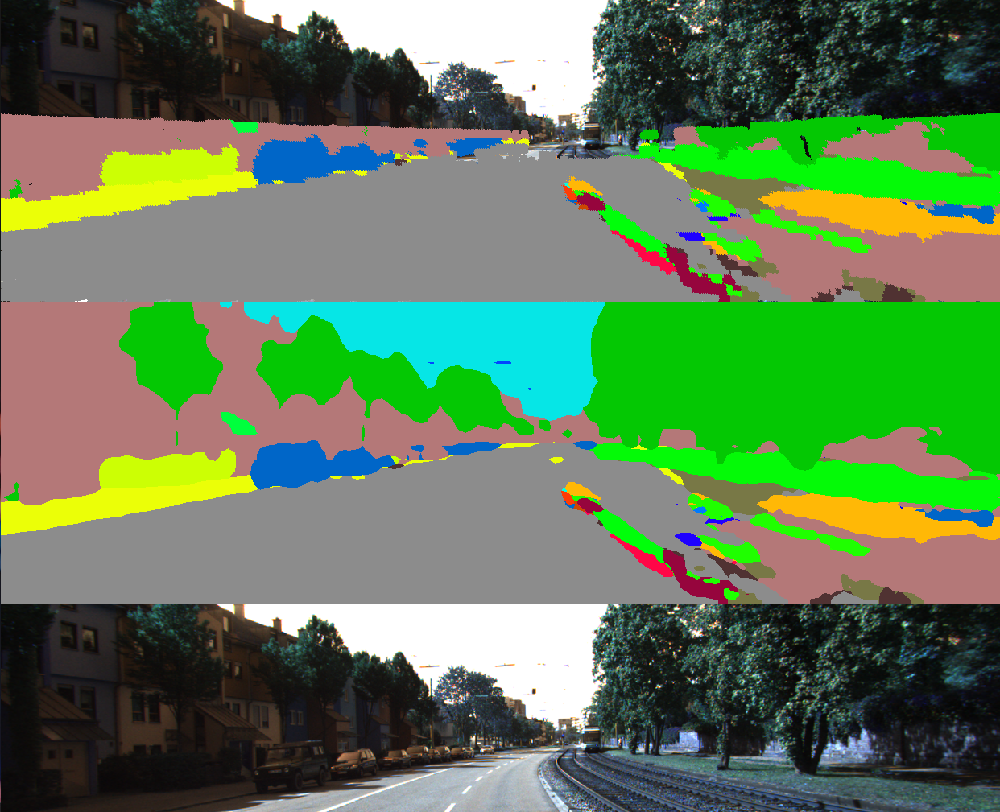
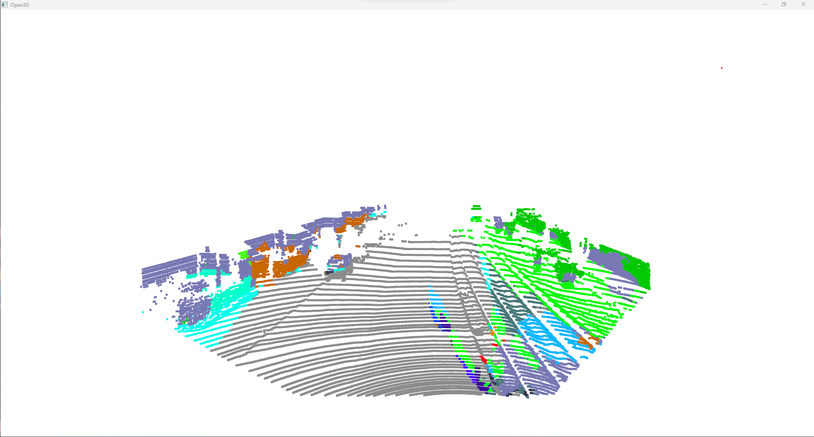

# LiDAR-RGB Semantics

Build a map from raw LIDAR point cloud and then transfer the predicted semantic labels from the camera image onto the LIDAR point cloud.



In the above figure:

    - Top: Segmented Lidar points projected onto RGB image 
    - Middle: Segmenation Result 
    - Bottom: RGB Image


The above figure represents the Semantic Point Cloud
## How to run

```python3 Wrapper.py```


## Data

Kitti 360 Dataset, Using Velodyne LiDAR raw data, rectified stereocamera RGB images and semantic labels and camera intrinsics and extrinsics between the two cameras.

Follow the following steps:

- Download rectified RGB images
    ```bash download_2d_perspective.sh```

- Download Velodyne point cloud
    ```bash download_3d_velodyne.sh```

- Download camera intrinsics and extrinsics
    (from https://s3.eu-central-1.amazonaws.com/avg-projects/KITTI-360/384509ed5413ccc81328cf8c55cc6af078b8c444/calibration.zip)

## Build Map

- Perform ICP to merge all the point clouds

## Semantic Segmentation using RGB

- Transform RGB image to Pointcloud (using the camera intrinsics and extrinsics)

- Put RGB info from images to pointcloud to check if the transformation is correct

- Segment the RGB images using any Semantic Net
    - Get predicted labels

- Transfer labels to point cloud to generate semantic point cloud
